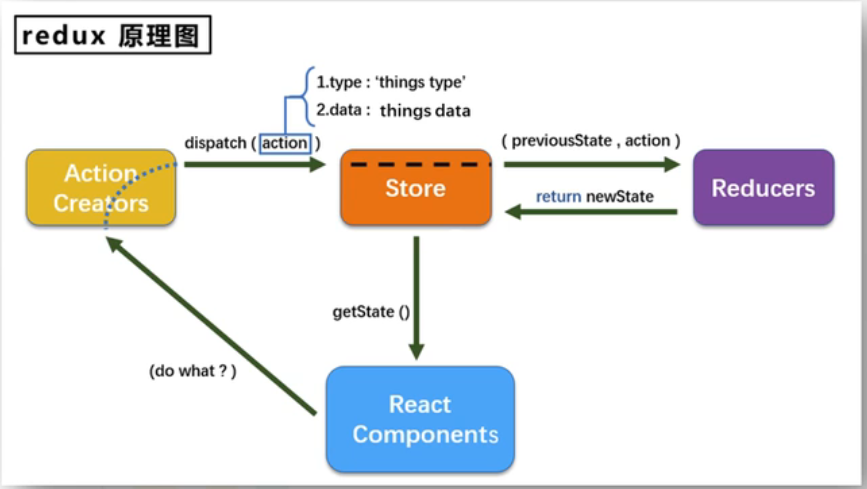

#


## redux

### redux 的理解
#### 文档
- 英文官网： https://redux.js.org
- 中文官网： https://cn.redux.js.org/
- 中文文档： https://www.redux.org.cn/
- GitHub: https://github.com/reduxjs/redux

#### redux 是什么
1. redux 是一个专门用于做**状态管理**的 JS 库（不是 React 插件库）
2. 它可以用在 React, Vue, Angular 等项目中，但基本与 React 配合使用
3. 作用：集中式管理 React 应用中多个组件**共享**的状态

#### 什么情况下需要使用 redux
1. 某个组件的状态需要让其他组件可以随时拿到（共享）
2. 一个组件需要改变另一个组件的状态（通信）
3. 总体原则：能不用就不用，如果不用比较吃力才考虑使用

#### redux 工作流程
1. redux 原理图


#### redux 的三个核心概念
1. Action
  - 动作的对象
  - 包含两个属性 1）type: 标识属性，值为字符串，唯一，必要属性。2）data: 数据属性，值类型任意，可选属性
  - 示例： `{type: 'ADD_STUDENT', data:{name: 'Tome', age: 18}}`
  - Action 为一般对象的叫 “同步 Action”，Action 为函数的叫 “异步 Action”
2. reducer
  - 用于初始化状态、加工状态
  - 加工时，根据旧的 state 和 action，产生新的 state 的**纯函数**
3. Store
  - 将 state, action, reducer 联系在一起的对象
  - 如何得到此对象
    ```javascript
      import {createStore} from 'redux'
      import reducer from './reducer'
      const store = createStore(reducer)
    ```
  - 此对象的功能
    - getState() 得到 state
    - dipatch(action) 分发 action，触发 reducer 的调用，产生新的 state
    - subscribe(listener) 注册监听器，产生新的 state 时，自动调用

安装 `npm redux`

### 求和案例 redux 精简版
1. 去除 Count 组件自身状态
2. src 下建立
    -src
      -redux
        -store.js
        -count_reducer.js
3. store.js
  - 引入 redux 中的 createStore 函数，创建一个store
  - createStore 调用时要传入一个为其服务的 reducer
  - 记得暴露 store
4. count_reducer.js
  - reducer 本质是一个函数，接收 preState, action，返回加工后的状体
  - reducer 有两个作用，初始化状态和加工状态
  - reducer 被第一次调用时，是 store 自动触发的，传递的 preState 是 undefined，传递的 action 是 “@@redux/INITr...”
5. 在 index.js 中监测 store 中状态的改变， 一旦发生改变，重新渲染 <App/>。备注： redux 只负责管理 state,至于 state 的改变驱动着页面的展示，需要我们自己写。

### 求和案例 redux 完整版
1. 新增 count_action.js
2. 新增 constant.js 

### 求和案例 redux 异步 Action 版
1. 明确：延迟的动作不想交给组件本身，想交给 Action
2. 何时需要异步 Action？想要对状态进行操作，但是具体的数据靠异步任务返回（非必须）
3. 具体编码：
  - `npm install redux-thunk`，并配置在 store 中
  - 创建 action 的函数不再返回一个一般对象，而是一个函数，该函数中写异步任务
  - 异步任务有结果后，分发给一个同步的 action 去真正操作数据。
  - 备注：异步 Action 不是必须要写的，完全可以自己等待异步任务的结果了再去分发给同步 Action

### 求和案例 redux react-redux 基本使用
安装 `npm install react-redux`
1. 明确两个概念：
  - UI 组件：不能使用任何 redux 的 API，只负责页面的呈现，交互等等
  - 容器组件：负责和 redux 通信，将结果交给 UI 组件
2. 如何创建一个容器组件，靠 react-redux 的 connect 函数
  ```
  connect(mapStateToProps, mapDispatchToProps)(UI组件)
  mapStateToProps： 映射状态，返回值是一个对象
  mapDispatchToProps：映射操作状态的方法，返回值是一个对象
  ```
3. 备注：容器中的 store 靠的是 props 传进去的，而不是在容器组件中直接引入的
4. 备注：mapDispatchToProps 也可以简写为一个对象

### 求和案例 redux react-redux 优化
1. 容器组件和 UI 组件整合成一个文件
2. 无需自己给容器组件传递 store，给 `<App/>` 包裹 `<Provider store={store}> </Provider>` 即可
3. 使用 react-redux 后也不用自己再监测 redux 中状态的改变了，容器组件可以自动完成这个工作
4. `mapDispatchToProps` 也可以简单写成一个对象
5. 一个组件要和 redux “打交道”需要经过哪几步？
  - 1). 定义好 UI 组件 —— 不暴露
  - 2). 引入 connect 生成一个容器组件并暴露，写法如下
    ```
    connect(
      state => ({key:value}),
      {key: xxxxxxAction}
    )(UI组件)
    ```
    3). 在组件中通过 `this.props.xxxxxx` 读取和操作状态


